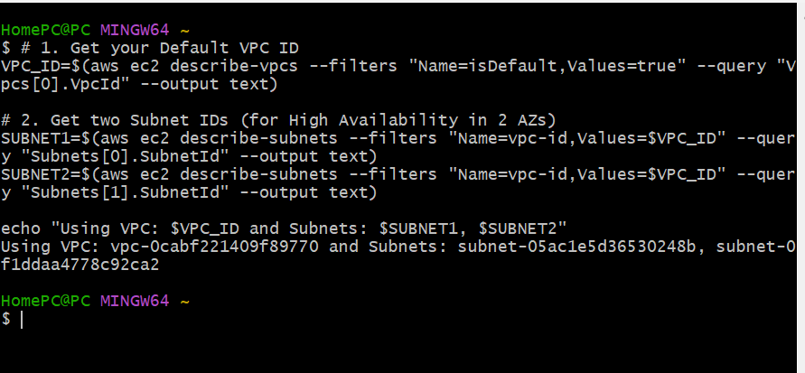
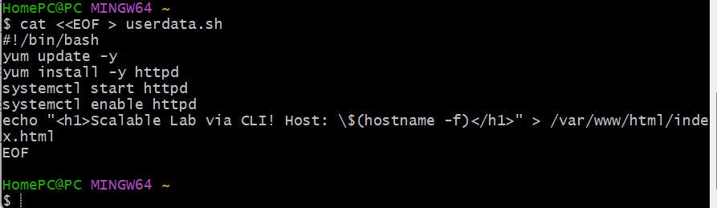
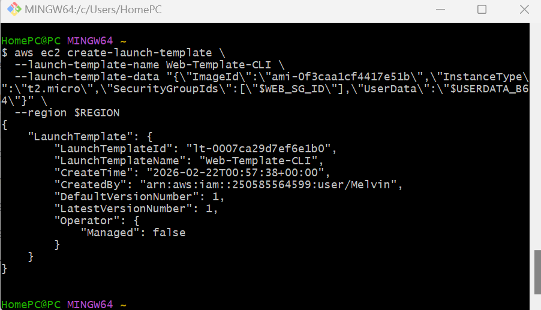
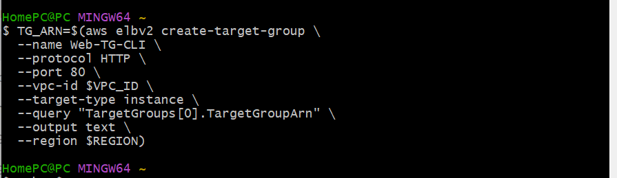
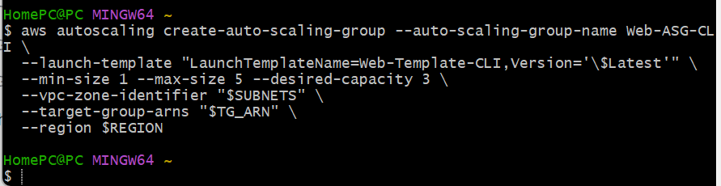

# AWS Scalable Web Architecture (End-to-End CLI Deployment)

This project demonstrates the deployment of a highly available, fault-tolerant, and scalable web infrastructure using the **AWS CLI**. By avoiding the Management Console, this project highlights proficiency in cloud automation and command-line operations.

## Architecture Overview
- **Networking:** Utilizes a Default VPC with Subnets across multiple Availability Zones.
- **Security:** Layered security groups for the Load Balancer (Public) and EC2 instances (Private/Internal).
- **Compute:** Auto Scaling Group (ASG) managing EC2 instances running Apache.
- **Scaling:** Target Tracking Policy based on CPU utilization.
- **Distribution:** Amazon CloudFront for global content delivery and reduced latency.

---

## Deployment Steps

### 1. Network Foundation
I began by identifying the Default VPC and selecting two public subnets in different Availability Zones to ensure high availability.

### 2. Security Configuration
Created two security groups: one for the Application Load Balancer (allowing port 80 traffic from the internet) and one for the web servers (allowing traffic only from the Load Balancer).

### 3. Server Automation (User Data)
I wrote a `userdata.sh` bootstrap script to automate the installation of the Apache web server, enable the service, and create a dynamic index page that displays the server's hostname.

### 4. Launch Template Creation
Defined a Launch Template containing the Amazon Linux 2 AMI, instance type (t2.micro), and the base64-encoded user data script.

### 5. Target Group & Health Checks
Configured a Target Group to monitor the health of the EC2 instances and manage traffic routing from the Load Balancer.

### 6. Application Load Balancer (ALB)
Deployed an ALB to serve as the single entry point for user traffic, distributing requests across the healthy instances in the Target Group.

### 7. Auto Scaling Group (ASG) Initialization
Created an ASG linked to the Launch Template and Target Group, ensuring the system maintains a desired capacity of 3 instances across multiple subnets.

### 8. Dynamic Scaling Policy
Implemented a Target Tracking Scaling Policy. The ASG will automatically add or remove instances to keep the average C