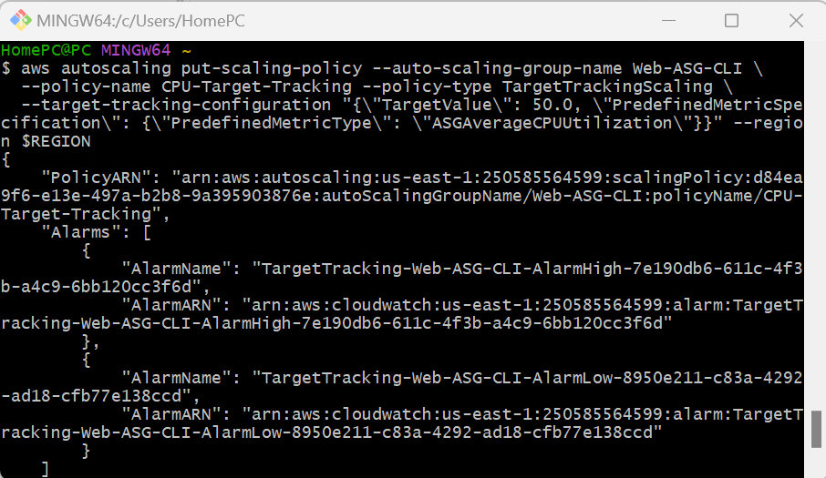
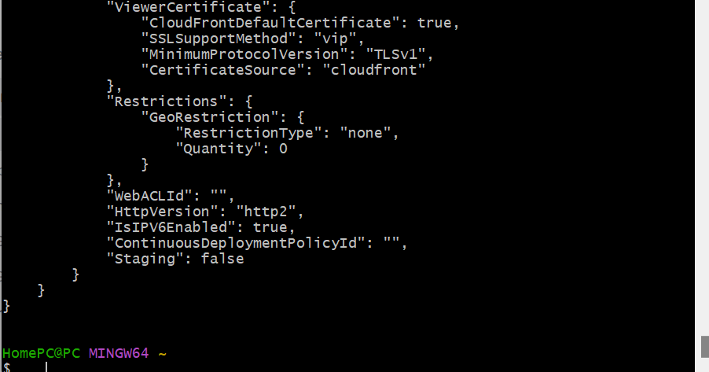
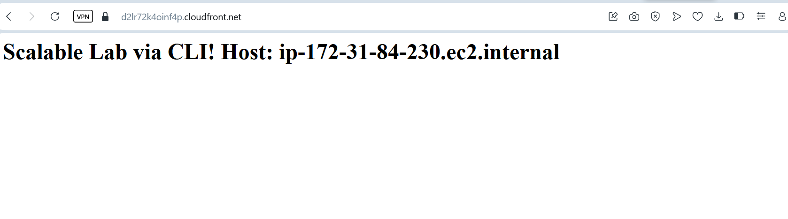

# AWS Scalable Architecture via CLI

This project demonstrates a highly available, scalable web infrastructure built using the AWS CLI.

## Project Steps

### 1. Network Foundation (VPC & Subnets)

### 2. Security Configuration

### 3. Instance Bootstrapping

### 4. Launch Template

### 5. Target Group Setup

### 6. Load Balancer Setup

### 7. Auto Scaling Group (ASG)

### 8. Scaling Policies

### 9. Content Delivery (CloudFront)

### 10. Final Verification
